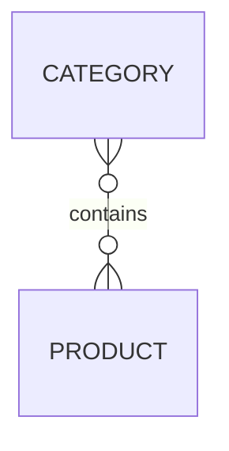
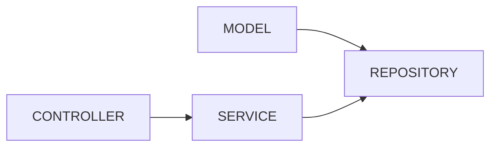
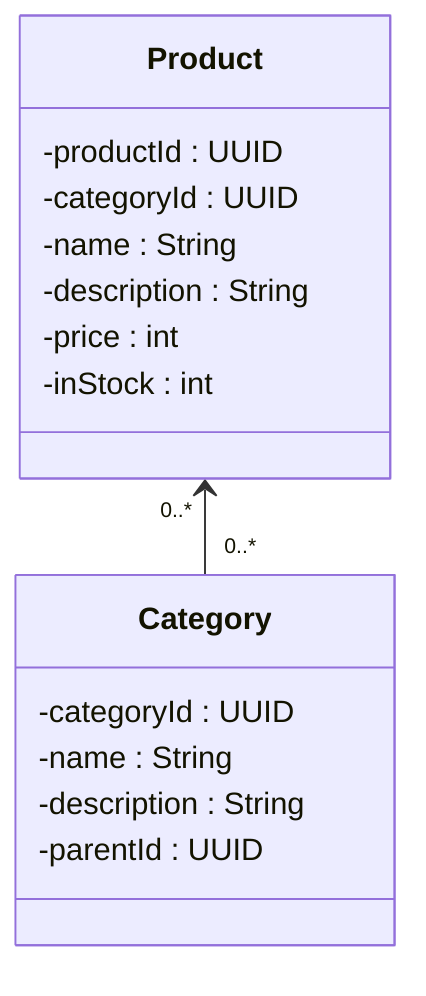
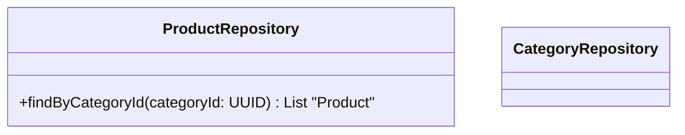
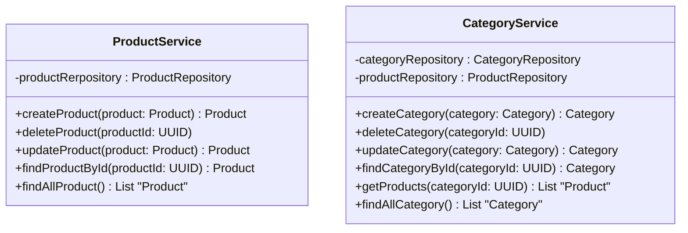
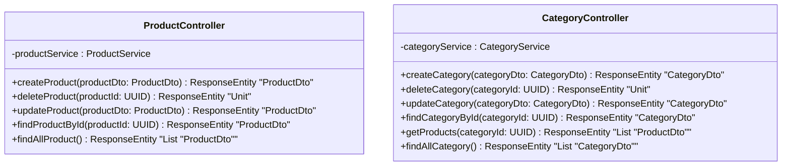

# Product Catalog
For users, navigating the product catalog is an essential feature. Effortlessly locate products by category, price range, or relevant criteria, ensuring a user-friendly and efficient shopping process. On the administrative side, the ability to modify, organize, and customize the product range provides control and flexibility, presenting a dynamic and appealing catalog.

## Entity relations

## Package relations

## Model Package

## Repository package

## Service package

## Controller package

## User Stories

As a customer, I want to be able to browse products by category, so that I can easily find items of interest.

As a customer, I want to be able to search for products by name or description, so that I can quickly locate specific items.

As a customer, I want to be able to view detailed information about a product, including its name, description, price, and availability, so that I can make an informed purchasing decision.

As a customer, I want to be able to filter products based on criteria such as price range, brand, or rating, so that I can narrow down my search results.

---

As an administrator, I want to be able to add new products to the catalog, including details such as name, description, price, and availability, so that the catalog remains up-to-date with the latest offerings.

As an administrator, I want to be able to update existing product information, such as price, availability, or description, so that I can make adjustments as needed.

As an administrator, I want to be able to organize products into categories and subcategories, so that customers can easily navigate and find products.

As an administrator, I want to be able to delete products from the catalog, ensuring that discontinued items are no longer displayed to customers.

