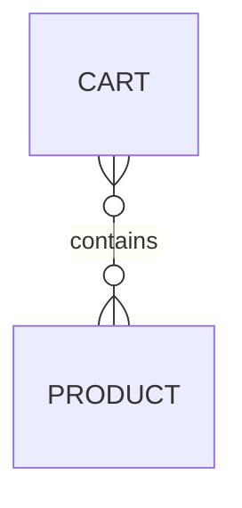
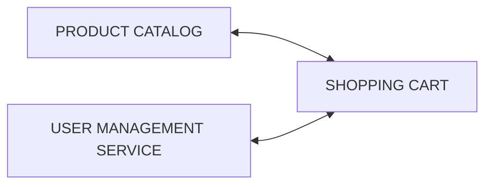
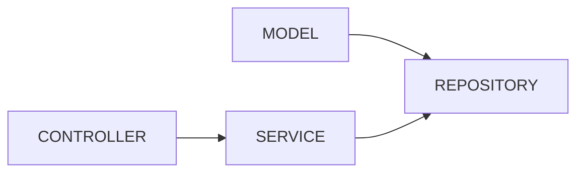
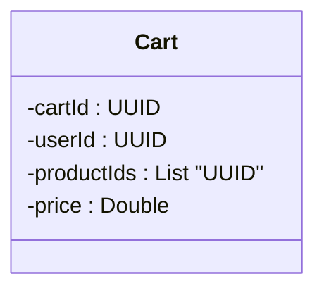

# Shopping Cart

The shopping cart feature should not only collect various products chosen to be purchased but also displays selected items, quantities, and prices. This element simplifies the decision-making process, aiding users in finalizing their selections before proceeding to checkout.

## Entity relations

## Relations to other services

## Package relations

## Model package

