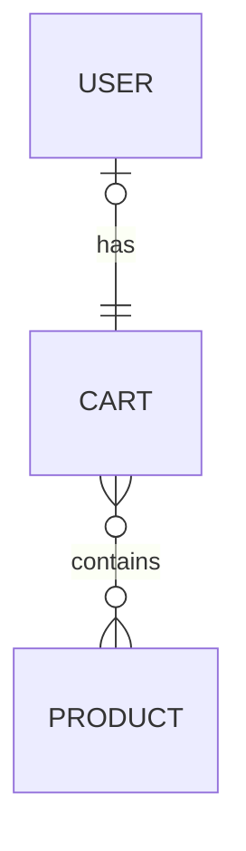
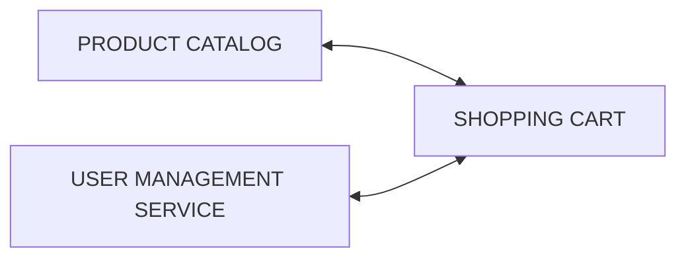
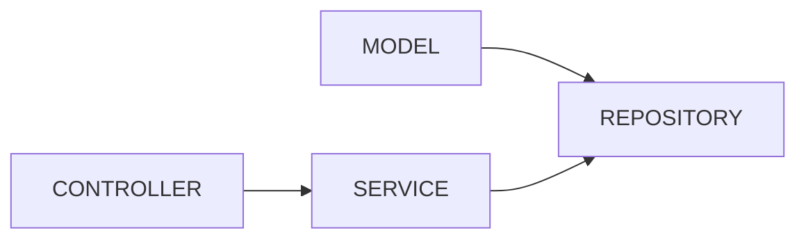
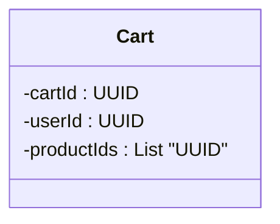
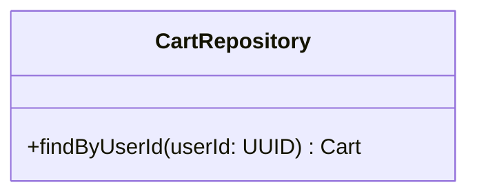
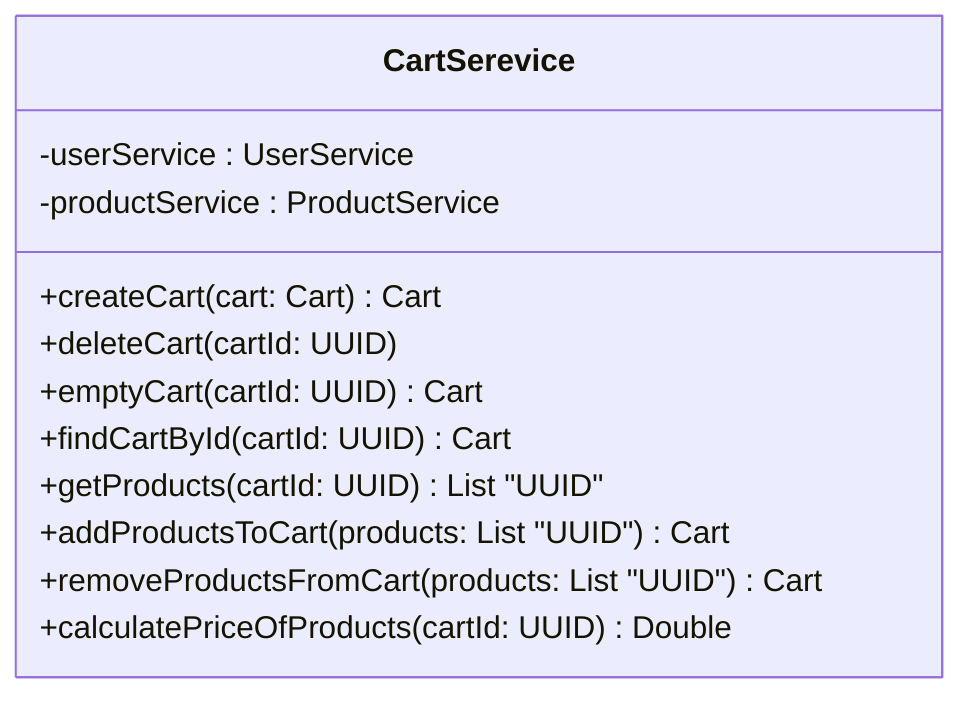
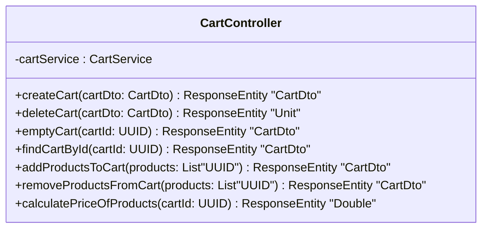

# Shopping Cart

The shopping cart feature should not only collect various products chosen to be purchased but also displays selected items, quantities, and prices. This element simplifies the decision-making process, aiding users in finalizing their selections before proceeding to checkout.

## Entity relations

## Relations to other services

## Package relations

## Model package

## Repository package

## Service package

## Controller package

## User stories

As a customer, I want to be able to add products to my shopping cart so that I can purchase them later.

As a customer, I want to be able to view the contents of my shopping cart so that I can see what items I have selected.

As a customer, I want to be able to remove products from my shopping cart so that I can change my selection before checking out.

As a customer, I want to be able to clear my entire shopping cart so that I can start over with a new selection.

As a customer, I want to be able to proceed to checkout from the shopping cart so that I can complete my purchase.

As a registered customer, I want to be able to save my shopping cart for later so that I can return to it at another time.
