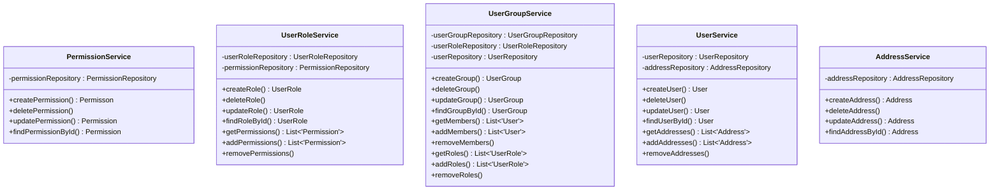
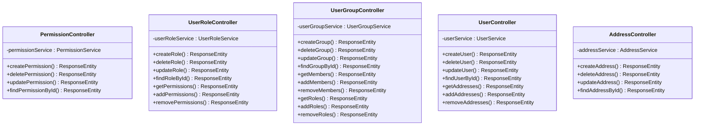

# User Management Service

## Entity relations

## Package relations

### Model package

### Repository package

### Service package

### Controller package

As a new user, I want to be able to create a new account securely, with my email address, password and other personal data, so that I can access personalized features in the web shop.

---

As a registered user, I want to be able to verify my email address, so that no one else can use it, except me.

As a registered user, I want to be able to log in to the web shop securely, with my email address and password, so that access my profile.

As a registered user, I want to be able to reset my password through a secure process using my email address, so that I can regain access to my account.

As a registered user, I want to receive email notifications for important account-related activities, so that I can stay informed about my account and filter out suspicious activities.

---

As a logged in user, I want to be able to change any personal data I registered with, so that I can always keep my user info up to date.

As a logged in user, I want to be able to manage my addresses, so that I can make sure they are correct.

---

As an admin user, I want to be able to view user accounts, so that I can monitor user activity.

As an admin user, I want to be able to reset passwords for user accounts, so that I can assist users.

As an admin user, I want to have access to user contact information, so that I can assist users effectively.

As an admin user, I want to be able to create and manage user groups with roles and permissions, so that I can organize users.

As an admin user, I want to be able to view a log of user-related activities, including account creations, password changes, and role modifications, so that I can track changes.

As a new user, I want to be able to create a new account securely, with my email address, password and other personal data, so that I can access personalized features in the web shop.

---

As a registered user, I want to be able to verify my email address, so that no one else can use it, except me.

As a registered user, I want to be able to log in to the web shop securely, with my email address and password, so that access my profile.

As a registered user, I want to be able to reset my password through a secure process using my email address, so that I can regain access to my account.

As a registered user, I want to receive email notifications for important account-related activities, so that I can stay informed about my account and filter out suspicious activities.

---

As a logged in user, I want to be able to change any personal data I registered with, so that I can always keep my user info up to date.

As a logged in user, I want to be able to manage my addresses, so that I can make sure they are correct.

---

As an admin user, I want to be able to view user accounts, so that I can monitor user activity.

As an admin user, I want to be able to reset passwords for user accounts, so that I can assist users.

As an admin user, I want to have access to user contact information, so that I can assist users effectively.

As an admin user, I want to be able to create and manage user groups with roles and permissions, so that I can organize users.

As an admin user, I want to be able to view a log of user-related activities, including account creations, password changes, and role modifications, so that I can track changes.
